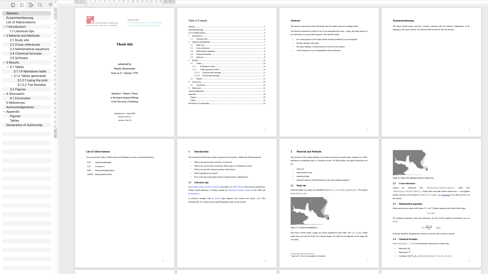

<!-- README.md is generated from README.Rmd. Please edit that file -->

# UHHthesis 

[](https://github.com/saskiaotto)
[](LICENSE)

This package is a customized version of the original
[thesisdown](https://github.com/ismayc/thesisdown) package developed by
Chester Ismay for the Reed College. It creates a *bookdown* project
structure with German or English LaTeX and Word thesis templates from
the University of Hamburg (UHH), which conform to the submission
standards of the MIN faculty for Bachelor and Master theses. The package
is primarily designed for the Biology Department but can be used by any
UHH student. It aims to encourage students to conduct reproducible
research using simple Markdown syntax while embedding all of the R code
to produce plots and analyses as well.

> UPDATE: **Looking for the Quarto version?** Want to combine R with
> Python or Julia, work in Positron, VS Code, or another editor of your
> choice, and use the latest publishing framework? The check out our
> latest tool
> [quarto-UHHthesis](https://github.com/uham-bio/quarto-UHHthesis) — the
> recommended choice for all new thesis projects.

> **Thesis Guide:** General guidance on planning, structuring, and
> writing your BSc or MSc thesis —from the initial research question to
> the final submission: [English
> (PDF)](https://github.com/uham-bio/quarto-UHHthesis/blob/main/docs/Guide_Thesis_BSc_MSc_TheSans.pdf?raw=true)
> \| [Deutsch
> (PDF)](https://github.com/uham-bio/quarto-UHHthesis/blob/main/docs/Leitfaden_Abschlussarbeit_BSc_MSc_TheSans.pdf?raw=true)

The *UHHthesis* package contains currently four templates:

1.  [PDF output for thesis written in
    German](https://github.com/saskiaotto/UHHthesis/blob/master/resources/examples/ex_thesis_pdf_de.pdf)
    (generated using the function `thesis_pdf_de()`)
2.  [PDF output for thesis written in
    English](https://github.com/saskiaotto/UHHthesis/blob/master/resources/examples/ex_thesis_pdf_en.pdf)
    (generated using the function `thesis_pdf_en()`)
3.  [Microsoft Word output for thesis written in
    German](https://github.com/saskiaotto/UHHthesis/blob/master/resources/examples/ex_thesis_word_de.docx)
    (generated using the function `thesis_word_de()`)
4.  [Microsoft Word output for thesis written in
    English](https://github.com/saskiaotto/UHHthesis/blob/master/resources/examples/ex_thesis_word_en.docx)
    (generated using the function `thesis_word_en()`)

Each templates generates a project structure with all required files,
which are already pre-filled with text as a starting help or
documentation. Comprehensive tutorial vignettes are available in English
and German — see `vignette("uhhthesis-tutorial-en")` and
`vignette("uhhthesis-tutorial-de")` — covering R Markdown basics,
figures (ggplot2), tables (kableExtra, flextable), cross-references,
citations, equations, and troubleshooting. If you are new to working
with [bookdown](https://bookdown.org/) and
[rmarkdown](https://rmarkdown.rstudio.com/), please read over this
documentation. To learn more about the *bookdown* and *rmarkdown*
packages in general, I highly recommend the following two online books
(see also [Useful resources](#useful-resources)):

- [R Markdown: The Definitive
  Guide](https://bookdown.org/yihui/rmarkdown/) by Yihui Xie, J. J.
  Allaire, and Garrett Grolemund
- [bookdown: Authoring Books and Technical Documents with R
  Markdown](https://bookdown.org/yihui/bookdown/) by Yihui Xie

## Installation

Install the *bookdown* and *UHHthesis* packages. Note that *UHHthesis*
is not available on CRAN so you have to install it from GitHub using the
*remotes* package as shown below.

``` r
# bookdown
if (!require("bookdown")) install.packages("bookdown")

# remotes and UHHthesis
if (!require("remotes")) install.packages("remotes")
remotes::install_github("uham-bio/UHHthesis", build_vignettes = TRUE)
```

## Getting started

### Creating a new project and rendering it within R Studio

Once you installed the package you might need to close and re-open R
Studio to see the `UHHthesis` templates listed.

1.  Choose **File** \> **New File** \> **R Markdown**, then select
    **From Template**. You should then be able to create a new document
    from one of the package templates:


2.  Choose the directory in which you want to save your project and
    provide a project name. In the screenshot above I name it
    `my_master_thesis` and save it on my desktop. That name will be used
    for both the main .Rmd file and the new project folder.
3.  Now change the working directory to this new project folder.
4.  In a next step, you need to **rename** this .Rmd file (in my case
    `my_master_thesis.Rmd`) to `index.Rmd`. If you forget to rename it
    you will get an error message when rendering the file


5.  This `index.Rmd` file is in fact **the only file in your thesis
    directory** you’ll ever going to **knit**! If you take a look at the
    other .Rmd files in the project folder, you’ll notice that none of
    them have a YAML header to tell what the output format should be
    like. If you are going to press the *knit* button for these files, R
    Studio will simply render them into single HTML files as default.
    **If it is your first time using this package I highly recommend to
    knit the `index.Rmd` immediately and use the output file as
    documentation on how to get started!**


6.  The output PDF or Microsoft Word thesis file rendered from the
    `index.Rmd` file will be placed in a new `thesis-output/`
    subdirectory along with its LaTeX or Markdown file.

7.  **Read the tutorial vignette** — run
    `vignette("uhhthesis-tutorial-en")` or
    `vignette("uhhthesis-tutorial-de")` in R — for detailed instructions
    on writing your thesis with R Markdown.

### Shortcut for the English PDF version

If you’ll write your thesis in English and want the PDF output format,
there is another way to create the thesis project file:

1.  In RStudio, click on **File** \> **New Project** \> **New
    Directory**.
2.  Then select **Thesis Project using UHHthesis (English PDF)** from
    the dropdown that will look something like the image below. You’ll
    see the graduation cap as the icon on the left for the appropriate
    project type.
3.  Next, give your project a name and specify where you’d like the
    files to appear. This time the main .Rmd file will be named
    automatically `index.Rmd`, so you don’t need to do anything further.


### Further requirements - LaTeX

In addition to Pandoc or R Studio being installed, you need to have
[LaTeX](https://www.latex-project.org/about/) installed if you want to
use the templates that convert R Markdown to PDF output formats.
Depending on your operating systems there are different distributions
you can use, e.g. for Mac there is [MacTeX](http://www.tug.org/mactex/),
which includes [TeXShop](https://pages.uoregon.edu/koch/texshop/), a
nice Mac-only editor for .tex documents. For other OS see here:
<https://www.latex-project.org/get/>

An easy way to install LaTeX on any platform is with the
[tinytex](https://yihui.org/tinytex/) R package:

``` r
install.packages('tinytex')
tinytex::install_tinytex()
# After restarting R Studio, confirm that you have LaTeX with 
tinytex:::is_tinytex() 
```

TinyTeX is a custom LaTeX distribution based on TeX Live that is small
in size but that includes most relevant functions (for R users). You
may, however, still need to install a few extra LaTeX packages on your
first attempt to knit when you use this package.

Although LaTeX is a powerful and popular tool in Academia, it can take a
while to learn the syntax and to find the correct formatting. R Markdown
and the PDF template in this packages offer a much simpler syntax and
the direct embedding of figures and tables, but at the cost of loosing
some of the expressiveness of LaTeX. However, you can insert LaTeX code
directly into the R Markdown files and also add LaTeX packages and
format styles in the YAML header.

If you want to know more about LaTeX, a good start is the *overleaf*
tutorial (and its entire documentation):
<https://www.overleaf.com/learn/latex/Learn_LaTeX_in_30_minutes>

------------------------------------------------------------------------

## The templates

The package provides comprehensive templates following the official
guidelines of the Department’s Academic office for the [Bachelor
thesis](https://www.biologie.uni-hamburg.de/studium/download/bachelor/vorgabe-bachelorarbeit.pdf)
as well as [Master
thesis](https://www.biologie.uni-hamburg.de/studium/download/master/vorgaben-masterarbeit-biologie.pdf).
The template comes in four versions, two for the PDF version in German
(`thesis_pdf_de`) and English (`thesis_pdf_en`) and two for the
Microsoft Word version in German (`thesis_word_de`) and English
(`thesis_word_en`).

The underlying functions wrap around the `pdf_book()` or
`word_document2()` functions from the
[bookdown](https://bookdown.org/home/about/) package, which is more
suitable for books and log-format reports and which provides additional
features such as figure/table caption numbering, cross-references or
inserting parts/appendices. *bookdown* also allows the splitting of
chapters or sections into individual files, keeping it thereby more
tidy.

The **PDF versions** follow exactly the UHH submission standards,
including the layout of the title page. So ideally, you opt for this
version. The underlying LaTeX templates are based on the University
templates provided by the [Department of
Socioeconomics](https://www.wiso.uni-hamburg.de/fachbereich-sozoek/professuren/szimayer/lehre/wissenschaftliche-arbeiten/bachelorarbeiten/vorlagen-fuer-abschlussarbeiten-in-latex-format.html)
as well as the Department of Informatics working groups
[VSIS](https://vsis-www.informatik.uni-hamburg.de/vsis/teaching/templates)
and [Security &
Privacy](https://www.inf.uni-hamburg.de/inst/ab/snp/courses/material/templates.html).

<div class="figure" style="text-align: center">


<p class="caption">

This is how the PDF thesis (in both languages) will finally look like.
</p>

</div>

However, if you do not want to limit yourself to the template design and
would like to share your thesis with others for collaborative editing
the **Word version** might be more suitable. But beware that there are
currently some limitations when rendering from R Markdown to MS Word.
For instance,

- the title page layout cannot be done completely from within R Markdown
  as in the PDF version. As a workaround, some of the text parts are
  currently placed under the ‘author’ section. The best solution is to
  modify the title page manually in Word right before submission. Use
  for the design the ‘front-page-example.pdf’ file.
- a table of figures and tables cannot be automatically generated as in
  the PDF version.

<div class="figure" style="text-align: center">


<p class="caption">

This is the final Word thesis document in English.
</p>

</div>

### Thesis components

The following components are the ones you should edit to customize your
thesis. Note that the template contains in all files some dummy text to
provide you some guidance and additional information. This should be
deleted of course.

| Component | Description |
|:---|:---|
| `index.Rmd` | Main file with YAML header (the **only** file to knit) |
| `_bookdown.yml` | Chapter order and configuration |
| `vignette("uhhthesis-tutorial-en")` / `vignette("uhhthesis-tutorial-de")` | Comprehensive tutorial on R Markdown for your thesis (run in R) |
| `prelim/` | Abstract, Zusammenfassung, Abbreviations |
| `chapter/` | Main thesis chapters |
| `bib/` | Bibliography (.bib) and citation style (.csl) files |
| `data/` | Data files referenced in chapters |
| `images/` | External images and logos |

### Day-to-day writing of your thesis

1.  Edit the individual chapter .Rmd files to write your thesis
2.  Knit `index.Rmd` to render the full document
3.  Use version control (Git/GitHub/GitLab) if possible
4.  For detailed guidance, see the tutorial vignette:
    `vignette("uhhthesis-tutorial-en")` or
    `vignette("uhhthesis-tutorial-de")`

### Citation tools

Store your bibliography in `bib/references.bib`. Good tools for managing
references are:

- [Zotero](https://www.zotero.org/) (recommended) with the [Better
  BibTeX](https://retorque.re/zotero-better-bibtex/) plugin
- RStudio’s **Visual Editor** has built-in citation search and insertion

Find additional citation styles at the [CSL Style
Repository](https://github.com/citation-style-language/styles#readme).

------------------------------------------------------------------------

## Useful resources

- R Markdown
  - The official [R Markdown
    documentation](https://rmarkdown.rstudio.com/lesson-1.html) from
    Posit
  - [R Markdown
    Cheatsheet](https://rstudio.github.io/cheatsheets/rmarkdown.pdf)
  - The online book [R Markdown: The Definitive
    Guide](https://yihui.org/rmarkdown/) by Yihui Xie, J. J. Allaire,
    and Garrett Grolemund
- Bookdown
  - The online book [bookdown: Authoring Books and Technical Documents
    with R Markdown](https://yihui.org/bookdown/) by Yihui Xie
- LaTeX
  - The official [LaTeX help and
    documentation](https://www.latex-project.org/help/documentation/)
  - The [overleaf](https://www.overleaf.com/learn) documentation
- Git
  - The online book [Happy Git and GitHub for the
    useR](https://happygitwithr.com/) is a novice-friendly guide to
    getting starting with using Git with R and RStudio.

------------------------------------------------------------------------

## Author

**Saskia Otto** University of Hamburg · Department of Biology ·
Institute of Marine Ecosystem and Fisheries Science ·
[GitHub](https://github.com/saskiaotto) ·
[Website](https://www.biologie.uni-hamburg.de/forschung/marine-oekosystemdynamik/mitarbeiter/otto-saskia.html)
