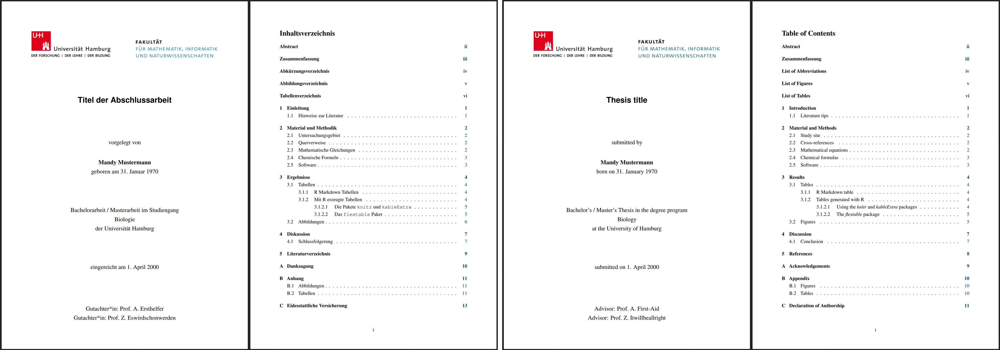

# Template gallery

Each template ships with example content covering text formatting,
equations, tables, figures with cross-references, and citations. Click
**Download demo** to get a ready-to-open example file.

------------------------------------------------------------------------

## PDF thesis

The **PDF versions** follow exactly the UHH submission standards,
including the layout of the title page. So ideally, you opt for this
version. The underlying LaTeX templates are based on the University
templates provided by the [Department of
Socioeconomics](https://www.wiso.uni-hamburg.de/fachbereich-sozoek/professuren/szimayer/lehre/wissenschaftliche-arbeiten/bachelorarbeiten/vorlagen-fuer-abschlussarbeiten-in-latex-format.html)
as well as the Department of Informatics working groups
[VSIS](https://vsis-www.informatik.uni-hamburg.de/vsis/teaching/templates)
and [Security &
Privacy](https://www.inf.uni-hamburg.de/inst/ab/snp/courses/material/templates.html).

PDF thesis template screenshot

\

[Download demo – English
(PDF)](https://github.com/uham-bio/UHHthesis/raw/master/resources/ex_thesis_pdf_en.pdf)
[Download demo – Deutsch
(PDF)](https://github.com/uham-bio/UHHthesis/raw/master/resources/ex_thesis_pdf_de.pdf)

------------------------------------------------------------------------

## Word thesis

If you do not want to limit yourself to the template design and would
like to share your thesis with others for collaborative editing the
**Word version** might be more suitable. But beware that there are
currently some limitations when rendering from R Markdown to MS Word.
For instance,

- the title page layout cannot be done completely from within R Markdown
  as in the PDF version. As a workaround, some of the text parts are
  currently placed under the ‘author’ section. The best solution is to
  modify the title page manually in Word right before submission. Use
  for the design the ‘front-page-example.pdf’ file.
- a table of figures and tables cannot be automatically generated as in
  the PDF version.

Word thesis template screenshot

\

[Download demo – English
(DOCX)](https://github.com/uham-bio/UHHthesis/raw/master/resources/ex_thesis_word_en.docx)
[Download demo – Deutsch
(DOCX)](https://github.com/uham-bio/UHHthesis/raw/master/resources/ex_thesis_word_de.docx)
