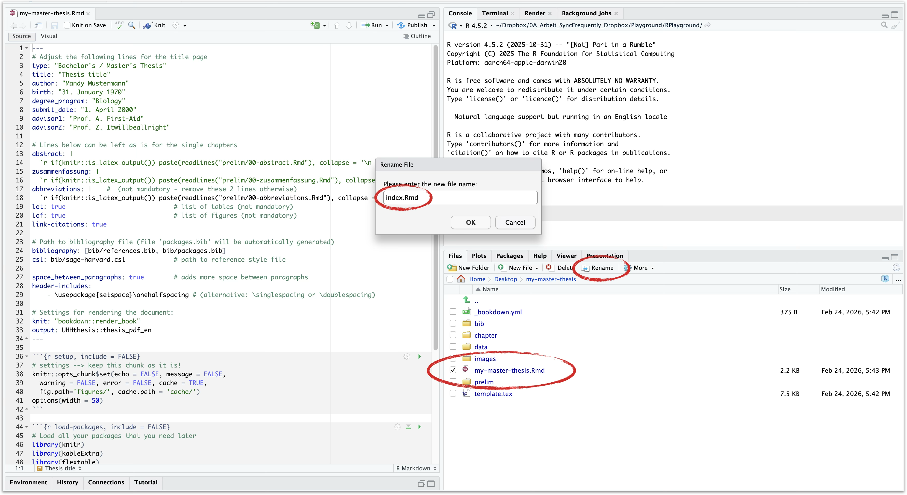
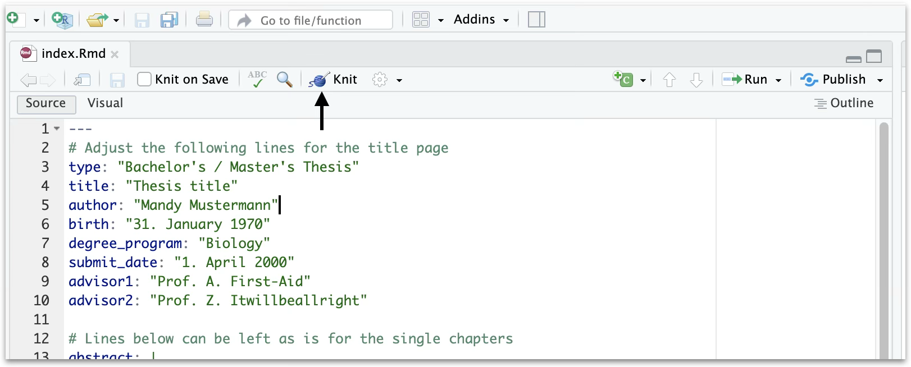

```{r setup, include=FALSE}
knitr::opts_chunk$set(echo = FALSE)
```

This guide walks you through installing the **UHHthesis** package, creating a new thesis project, understanding the project layout, and producing your first PDF or Word output.

Once your project is set up, see [Writing Your Thesis](uhhthesis-tutorial-en.html) for a complete reference on YAML configuration, R Markdown syntax, figures, tables, equations, citations, cross-references, and troubleshooting.

---

## 1. Prerequisites

### Required software

| Software | Minimum version | Where to get |
|:---------|:----------------|:-------------|
| R | ≥ 4.2 | <https://cran.r-project.org> |
| RStudio or Positron | current release | <https://posit.co/downloads/> |
| LaTeX | any | see below (TinyTeX recommended) |

### Installing LaTeX (TinyTeX)

For PDF output you need a LaTeX distribution. The easiest option across all platforms is [TinyTeX](https://yihui.org/tinytex/), a lightweight TeX Live distribution that automatically installs missing packages:

```r
install.packages("tinytex")
tinytex::install_tinytex()
# After restarting RStudio, verify:
tinytex:::is_tinytex()
```

Alternative full distributions: [MacTeX](https://www.tug.org/mactex/) (macOS), [MikTeX](https://miktex.org/) (Windows), or TeX Live (Linux).

### Installing the UHHthesis package

```r
# Install dependencies
if (!require("bookdown")) install.packages("bookdown")
if (!require("remotes"))  install.packages("remotes")

# Install UHHthesis from GitHub
remotes::install_github("uham-bio/UHHthesis")
```

Recommended packages used in the templates:

```r
install.packages(c("knitr", "kableExtra", "flextable", "ggplot2"))
```

---

## 2. Creating Your Thesis Project

There are two ways to create a new thesis project. **Method 2 is recommended** because it names the main file correctly for you.

### Method 1 — From Template

1. In RStudio: **File > New File > R Markdown... > From Template**
2. Select one of the UHHthesis templates:

```{r, fig.align='center', fig.alt="RStudio dialog showing the UHHthesis templates"}
knitr::include_graphics("images/img_create_document.jpg")
```

3. Choose a directory name and location, then click **OK**
4. **Important:** Rename the generated file to **`index.Rmd`**. The build will fail if the main file is not called `index.Rmd`.

```{r, fig.align='center', out.width="100%", fig.alt="Renaming skeleton.Rmd to index.Rmd in the RStudio Files pane"}

```

### Method 2 — New Project (recommended)

1. In RStudio: **File > New Project > New Directory**
2. Select **Thesis Project using UHHthesis (English PDF)** (or the German version) from the dropdown:

```{r, fig.align='center', out.width="100%", fig.alt="RStudio New Project dialog with UHHthesis option"}
knitr::include_graphics("images/img_create_project.jpg")
```

3. Choose a directory name and location, then click **Create Project**
4. The project is ready — `index.Rmd` is already named correctly.

---

## 3. Project Structure

After creating your project you will see the following files and folders:

```
your-thesis/
├── index.Rmd              # Main file — the ONLY file you knit
├── _bookdown.yml          # Chapter order and output settings
├── template.tex           # LaTeX template (do not edit unless advanced)
├── chapter/
│   ├── 01-intro.Rmd       # Introduction
│   ├── 02-methods.Rmd     # Material and Methods
│   ├── 03-results.Rmd     # Results
│   ├── 04-discussion.Rmd  # Discussion
│   ├── 96-references.Rmd  # References (auto-generated, do not edit)
│   ├── 97-acknowledge.Rmd # Acknowledgements (optional)
│   ├── 98-appendix.Rmd    # Appendix (optional)
│   └── 99-declaration.Rmd # Declaration of Authorship (obligatory)
├── prelim/
│   ├── 00-abstract.Rmd        # English abstract
│   ├── 00-zusammenfassung.Rmd # German summary
│   └── 00-abbreviations.Rmd   # List of abbreviations (optional)
├── bib/
│   ├── references.bib     # Your literature references (edit this)
│   ├── packages.bib       # Auto-generated R package references
│   └── sage-harvard.csl   # Citation style (replaceable)
├── data/                  # Place your data files here
├── images/                # Logos and external images
└── thesis-output/         # Generated PDF/Word files appear here
```

### Key files and folders explained

#### `index.Rmd`

This file contains the [YAML](https://yaml.org/) header, i.e. all meta information, which must appear at the beginning of your document. The file should not contain anything other than the YAML header and the few code chunks that follow! The text you'll see after the code chunks is for your information only and should be deleted once you have read it. 

The first lines in the YAML header configure the title page. Modify these as needed. In the following lines you will find comments explaining which entries must remain unchanged and which you may edit.

**Always knit this file th build the thesis.** 

#### `_bookdown.yml`

This is the main configuration file for your thesis. It determines which .Rmd files are included in the output and in what order. Arrange the order of your chapters in this file and ensure that the filenames match those in the corresponding folders.

#### `prelim/`

This folder contains .Rmd files for the sections that appear before the main part of your thesis, i.e. the *Abstract*, *Zusammenfassung* (the German summary), and the *List of Abbreviations* (optional). The *List of Tables* and *List of Figures* are also optional and are generated automatically, so no additional .Rmd files are required.

#### `chapter/`

This folder contains the .Rmd files for each chapter in your thesis (e.g. `01-intro.Rmd`, `02-methods.Rmd`, etc.). **Write your thesis in these files**. If you're working in RStudio, you may find the package [wordcountaddin](https://github.com/benmarwick/wordcountaddin) useful for obtaining word counts and readability statistics in R Markdown documents.

This folder also contains the back matter (i.e. reference list, acknowledgements, supporting tables and figures from your method and result sections, and your declaration of authorship). 
*Please note: the file* `96-references.Rmd` *is generated automatically. You do not need to add or modify anything in this file!*

#### `bib/`

This folder contains the bibliography files. Add your references to `references.bib`. The file `packages.bib` file is generated automatically. 

#### `data/` and `images/`

Store your data files and all images that are embedded in your thesis here and reference them in your R Markdown files. See the *method* chapter in the template and chapter [2.2.1](https://bookdown.org/yihui/bookdown/markdown-extensions-by-bookdown.html#equations) in the bookdown online documentation for details on cross-referencing tables and figures in R Markdown.

#### `thesis-output/`

Created automatically when you knit the project. Contains the final PDF or Word file. 

---

## 4. Rendering Your Thesis

Open `index.Rmd` in RStudio and click the **Knit** button (or press `Ctrl+Shift+K` / `Cmd+Shift+K`):

```{r, fig.align='center', out.width="75%", fig.alt="Knit button in RStudio for index.Rmd"}

```

You can also render from the R console:

```r
bookdown::render_book("index.Rmd")
```

The output file (`thesis.pdf` or `thesis.docx`) appears in the `thesis-output/` folder.

> **Golden rule:** Only ever knit `index.Rmd`. Never knit individual chapter files — bookdown merges all chapters automatically.

### Switching to Word output

To produce a Word document instead of PDF, change the `output:` line in the YAML header of `index.Rmd`:

```yaml
output: UHHthesis::thesis_word_en
```

If you are working with a Word template, use the Word-specific project template (**UHH thesis in English (Word)**), which uses `flextable` instead of `kableExtra` for tables, since `kableExtra` does not render correctly in Word output.

### Missing LaTeX packages

If a LaTeX package is missing during rendering, install it with:

```r
tinytex::tlmgr_install("packagename")
```

TinyTeX usually installs missing packages automatically, but occasionally a manual install is needed.

---

Next: [Writing Your Thesis](uhhthesis-tutorial-en.html) — R Markdown syntax, figures, tables, equations, citations, cross-references, and troubleshooting.
